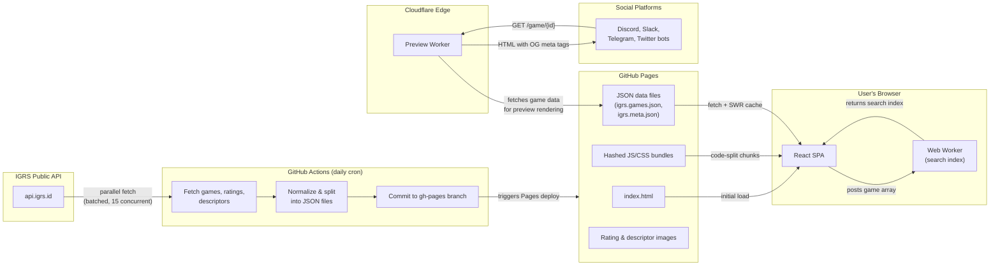

# Architecture

This document describes the system architecture of the IGRS (Indonesian Game Rating System) web application — an unofficial frontend for browsing and searching the IGRS public database.

## System Components

| Component | Technology | Purpose |
|---|---|---|
| **SPA** | Vite 8 + React 19 + TypeScript 6 | Client-side application: search, browse, and display game rating data |
| **GitHub Pages** | Static hosting | Serves the built SPA, JSON data files, and static assets |
| **Cloudflare Worker** | TypeScript on Cloudflare edge | Intercepts bot requests to `/game/*` and serves social media preview pages |
| **GitHub Actions** | CI/CD workflows | Builds the app, refreshes game data from the IGRS API, and deploys to Pages |

## Data Flow



### Data Flow Summary

1. **Data ingestion**: A scheduled GitHub Actions workflow (`update-igrs-db.yml`) fetches all games from the IGRS public API in parallel batches, downloads ratings and descriptor metadata, normalizes the data with `jq`, and commits the resulting JSON files to the repository.

2. **Build and deploy**: On push to `gh-pages`, the Pages workflow installs dependencies, runs checks (lint, test, build), and deploys the `dist/` directory to GitHub Pages.

3. **Runtime data loading**: The SPA fetches `igrs.games.json` and `igrs.meta.json` from GitHub Pages. A module-level stale-while-revalidate cache serves previously loaded data instantly and revalidates in the background after 5 minutes.

4. **Search indexing**: The game array is posted to a Web Worker that builds the search index off the main thread. Once complete, the index is transferred back and search becomes interactive.

5. **Social previews**: When a bot user-agent requests `/game/{id}`, the Cloudflare Worker intercepts the request, fetches game data from GitHub Pages, and returns an HTML page with Open Graph and Twitter Card meta tags. Normal browsers receive a 302 redirect to the SPA.

## Deployment Topology

```
┌─────────────────────────────────────────────────────────────┐
│                     Cloudflare (CDN + DNS)                   │
│                                                             │
│  ┌───────────────────────┐    ┌──────────────────────────┐  │
│  │   Cache Rules          │    │   Worker (edge)          │  │
│  │   • Hashed assets: 1yr │    │   • Route: /game/*       │  │
│  │   • HTML: no-cache     │    │   • Bot → preview HTML   │  │
│  │   • JSON data: 1hr     │    │   • Browser → 302 to SPA │  │
│  └───────────┬───────────┘    └──────────┬───────────────┘  │
│              │                            │                   │
└──────────────┼────────────────────────────┼──────────────────┘
               │                            │
               ▼                            ▼
┌──────────────────────────┐    ┌──────────────────────────┐
│   GitHub Pages            │    │   GitHub Pages            │
│   (igrs.madeby.my.id)     │    │   (JSON data source)      │
│                           │    │                           │
│   • index.html            │    │   • igrs.games.json       │
│   • vendor-[hash].js      │    │   • igrs.meta.json        │
│   • app-[hash].js         │    │   • igrs.extra.json       │
│   • route chunks (lazy)   │    │                           │
│   • CSS modules           │    │                           │
│   • Static images         │    │                           │
└──────────────────────────┘    └──────────────────────────┘
```

**Domain**: `igrs.madeby.my.id` — custom domain on the `madeby.my.id` Cloudflare zone.

**Environments**:
- **Production**: Worker deployed as `igayrsbackend`, route pattern `igrs.madeby.my.id/game/*`
- **Staging**: Worker deployed as `igayrsbackend-staging`, route pattern `staging-igrs.madeby.my.id/game/*`

## Cloudflare Worker Role

The Cloudflare Worker (`ops/worker/worker.ts`) solves a fundamental limitation of SPAs: social media bots do not execute JavaScript, so they cannot read the dynamically rendered game detail pages.

**How it works:**

1. The Worker is configured (via `wrangler.toml`) to intercept all requests matching `/game/*` on the production domain.
2. It inspects the `User-Agent` header to determine if the request comes from a known bot (Discord, Slack, Telegram, Twitter, Facebook, etc.).
3. **Bot requests** receive a server-rendered HTML page containing:
   - Open Graph meta tags (`og:title`, `og:description`, `og:image`)
   - Twitter Card meta tags
   - An oEmbed link for rich embed consumers
   - A `<script>` redirect to the SPA (for bots that follow redirects)
4. **Normal browser requests** receive a 302 redirect to the SPA game detail page.
5. The `/game/{id}/oembed` path returns oEmbed JSON for platforms that support it.

**Data caching**: The Worker maintains a module-level cache of game data (5-minute TTL) fetched from GitHub Pages, avoiding repeated fetches for each preview request.

**Security**: HTML responses include CSP headers (`default-src 'none'`, restricted `img-src`, `frame-ancestors 'none'`), `X-Content-Type-Options: nosniff`, and `X-Frame-Options: DENY`.

## Key Architectural Decisions

### CSS Modules over CSS-in-JS

Vite's built-in CSS Modules with LightningCSS provide zero-runtime style scoping. No additional runtime dependencies, no JavaScript overhead for style computation, and full compatibility with the existing build pipeline.

### Web Worker for Search Indexing

Building the search index for the current 593-game checked-in snapshot is an O(n) operation, and future data growth can make that work visible on the main thread. Offloading to a Web Worker keeps the UI responsive during initial load. The index is transferred back via structured clone (Sets serialized as arrays, reconstructed on the main thread).

### Stale-While-Revalidate (Custom Module)

A lightweight module-level cache avoids adding TanStack Query as a dependency for a single data source. The implementation serves cached data immediately and revalidates in the background after 5 minutes, providing instant page loads on return visits.

### Virtual Scrolling with @tanstack/react-virtual

For result sets exceeding 100 items, virtual scrolling renders only visible items plus a 5-item overscan buffer. This maintains smooth 30+ FPS scrolling regardless of total result count. Below 100 items, traditional pagination (30/page) is used for simplicity.

### Route-Level Code Splitting

`React.lazy()` splits RatingsPage, SteamCheckerPage, and GamePage into separate chunks. Users only download code for pages they visit. Each lazy route has its own error boundary with retry capability.

### Vendor Chunk Separation

React, React DOM, React Router, Lucide React, and Valibot are grouped into a dedicated `vendor-[hash].js` chunk. Application code changes do not invalidate the vendor cache, reducing repeat-visit download sizes.

## Bundle Strategy

| Chunk | Contents | Cache Strategy |
|---|---|---|
| `vendor-[hash].js` | react, react-dom, react-router-dom, lucide-react, valibot | Immutable (1 year) |
| `app-[hash].js` | Core app shell, router, providers | Immutable (1 year) |
| Route chunks (lazy) | Per-page code (search, ratings, steam-checker, game) | Immutable (1 year) |
| `*.module.css` | Feature-scoped styles | Immutable (1 year) |
| `global-[hash].css` | Reset, tokens, typography | Immutable (1 year) |
| `igrs.games.json` | Game data (current snapshot: 593 entries) | 1 hour + stale-while-revalidate |
| `igrs.meta.json` | Ratings and descriptor metadata | 1 hour + stale-while-revalidate |
| `i18n/*.json` | Translation dictionaries (en, id) | 1 hour + stale-while-revalidate |

## CI/CD Pipelines

| Workflow | Trigger | Purpose |
|---|---|---|
| `ci.yml` | Push to main, PRs | Lint, typecheck, test (Node 18 + 22 matrix), build, bundle size check |
| `pages.yml` | Push to gh-pages | Build and deploy to GitHub Pages |
| `update-igrs-db.yml` | Daily cron (00:00 UTC) | Fetch fresh data from IGRS API, validate integrity, commit to repo |

## Technology Stack

- **Runtime**: Vite 8, React 19, TypeScript 6
- **Styling**: CSS Modules (LightningCSS), CSS custom properties for design tokens
- **Routing**: React Router DOM 7 (BrowserRouter)
- **Validation**: Valibot
- **Icons**: Lucide React
- **Virtualization**: @tanstack/react-virtual
- **Sanitization**: DOMPurify
- **Testing**: Vitest, fast-check (property-based), Testing Library
- **Worker runtime**: Cloudflare Workers (Wrangler CLI)
- **Hosting**: GitHub Pages + Cloudflare CDN
